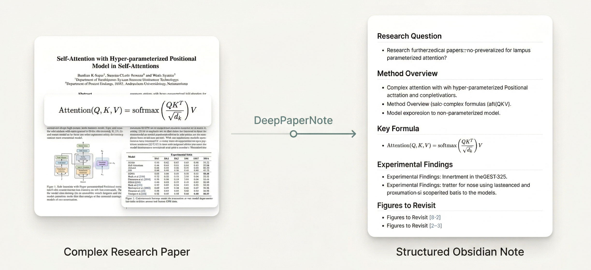

<div align="center">

# DeepPaperNote

**把一篇难读的论文，变成一份真正值得保留的 Obsidian 深度笔记。**

[English](./README.md) | [简体中文](./README.zh-CN.md)

[](https://github.com/917Dhj/DeepPaperNote)
[](https://github.com/917Dhj/DeepPaperNote/releases/tag/v1.0.1)
[](./LICENSE)
[](./SKILL.md)
[](./references/obsidian-format.md)
[](./references/figure-placement.md)
[](./references/model-synthesis.md)
[](./CHANGELOG.md)

</div>


**你是否经常遇到这种情况：准备精读一篇经典论文时，最累的往往不是看，而是整理成笔记**。真正耗时间的，通常是这些环节：

- 在 PDF、Zotero、网页和笔记软件之间来回切换
- 手动整理元数据、摘要、图表和方法主线
- 明明已经读懂了一部分，却还要花很多时间把它写成结构化笔记
- 最后留下的仍然只是一篇“看起来完整，但以后未必还想回看”的笔记

DeepPaperNote 想解决的，就是这一层重复、机械、但又非常耗时的工作。它会先把整理、结构化、图表定位和笔记成形这些环节做掉，让你把精力留给真正的思考。

DeepPaperNote 是一个面向**论文深度阅读**的技能，同一套核心能力可以运行在 Claude Code 和 Codex 上。它更关注：

- 论文到底在解决什么问题
- 方法机制是怎么工作的
- 关键公式、实验结论和图表信息是否被保留下来
- 最终能不能沉淀成一份**适合长期积累的 Obsidian 笔记**

> [!tip]
> 如果你已经有自己的 Obsidian / Zotero 工作流，DeepPaperNote 会把最耗时、最容易出错的取证、整理和成稿环节自动化。

## 🎯 它帮你解决什么问题？



| 🎯 你的需求 / 痛点 | ✅ DeepPaperNote 怎么帮你 |
| --- | --- |
| 想快速读懂一篇很难啃的复杂论文 | 自动整理方法主线、关键结果、图表上下文和局限，生成能直接阅读的深度笔记 |
| 想精读一篇经典论文，但不想手写很多机械笔记 | 自动完成元数据整理、结构搭建、图表占位和正文笔记生成，专注于真正有价值的理解 |
| 想把论文真正沉淀进 Obsidian | 会结合论文领域自动归档到合适的 Obsidian 目录，再生成论文同名文件夹、Markdown 笔记和 `images/` 目录 |
| 已经在 Zotero 里管理文献，不想重复折腾 | 可优先复用本地论文库和附件，减少误匹配，也通常更快 |
| 不想只得到一篇“漂亮摘要” | 更强调机制拆解、关键数字、公式、边界条件和真实局限 |

## ✨ 它是怎么做到的？

DeepPaperNote 不是靠“把摘要重新措辞一遍”来显得更完整，而是靠下面这几条工作流原则，把笔记质量往上抬：

| 🧭 核心原则 | 📝 具体体现 |
| --- | --- |
| 🤖 模型主导理解 | 真正负责机制拆解、方法主线、关键比较和局限分析的是模型，而不是模板化摘要。 |
| 🗂️ 证据优先 | 先从 PDF、元数据和可选的 Zotero 工作流里取证，再基于证据写作，而不是先写结论再去找依据。 |
| 🧪 技术细节优先 | 对技术论文，会尽量保留关键数字、公式、实现逻辑和真实边界条件，而不是停在高层概括。 |
| 🖼️ 图表占位优先 | 图像提取不稳时，也先保留图表位置、说明和上下文，避免笔记结构断掉。 |
| 🔗 原生沉淀到知识库 | 会先按论文领域归档到现有知识库结构，再为每篇论文生成独立文件夹、Markdown 笔记和 `images/` 目录，更适合长期积累。 |
| 📚 本地文献优先 | 如果论文已经在 Zotero 里，优先复用本地条目和附件，通常更稳，也往往更快。 |

**一句话说：**

> DeepPaperNote 更像一个“论文读书笔记生成工作流”，而不是“论文摘要总结器”。

## 👀 它更适合谁

<table>
  <tr>
    <td valign="top" width="33%">
      <strong>👓 啃硬核论文、精读经典论文的人</strong><br><br>
      你读的不是扫一眼摘要就结束的论文，而是公式多、架构复杂、实验设计绕、值得反复回看的论文。你需要的不是一篇“漂亮总结”，而是一份能帮你把方法主线、关键结果和图表结构真正理清楚的笔记。
    </td>
    <td valign="top" width="33%">
      <strong>🗂️ 用 Obsidian 做长期知识沉淀的人</strong><br><br>
      你希望论文笔记不是一次性消费品，而是能长期回看、链接、复用的知识资产。DeepPaperNote 会结合论文领域归档到更合适的位置，再生成 Markdown 笔记和 <code>images/</code> 文件夹，让沉淀这件事更顺手。
    </td>
    <td valign="top" width="33%">
      <strong>🤖 不满足于 AI 摘要总结的人</strong><br><br>
      你不是只想看一段“看起来很完整”的摘要，而是想知道：这篇论文到底解决了什么、方法是怎么工作的、哪些结果最重要、哪里最容易被误读。DeepPaperNote 更接近研究笔记，而不是摘要生成器。
    </td>
  </tr>
</table>

## 🚀 快速上手

### 1) 将 DeepPaperNote 安装到你的 agent 技能目录

DeepPaperNote 同时支持 Claude Code 和 Codex。

#### npx Skills（推荐）

大多数情况下，可以直接从npx安装：

```bash
npx skills add 917Dhj/DeepPaperNote
```

此命令会默认安装到共享的`.agent/skills`目录，这个目录中的 skill 可以被 Codex 等大部分 agent 识别并使用。如果你也想在 Claude Code 里使用，在 **Additional agents** 提示中选择 Claude Code即可。

你也可以直接指定安装给某个 agent：

```bash
npx skills add 917Dhj/DeepPaperNote -a codex
npx skills add 917Dhj/DeepPaperNote -a claude-code
```

#### 手动安装

如果你更习惯手动安装，推荐去 [release](https://github.com/917Dhj/DeepPaperNote/releases) 页面下载最新版本的 zip 包并解压。

Codex 用户可以把解压出来的 `DeepPaperNote` 文件夹放到：

```bash
~/.codex/skills/DeepPaperNote
```

Claude Code 用户可以把解压出来的 `DeepPaperNote` 文件夹放到：

```bash
~/.claude/skills/DeepPaperNote
```

也可以直接 `git clone`：

```bash
git clone https://github.com/917Dhj/DeepPaperNote.git ~/.codex/skills/DeepPaperNote
git clone https://github.com/917Dhj/DeepPaperNote.git ~/.claude/skills/DeepPaperNote
```

安装完成后，重启你的 agent 让技能生效。

### 2) 安装核心 Python 依赖

在正式处理论文前，需要安装最核心的 Python 依赖：

```bash
python3 -m pip install PyMuPDF
```

为什么这一步很重要：

- DeepPaperNote 读取 PDF 主要依赖 `PyMuPDF`
- 如果没装 `PyMuPDF`，最核心的 PDF 抽取流程就跑不起来

### 3) 直接开始使用

接下来你只需要把论文丢给 agent 就行，标题、DOI、URL、本地 PDF 都可以，你可以直接给出类似这样的指令：

- 💬 `给这篇论文生成深度笔记：Attention Is All You Need`
- 💬 `把这篇文章整理成 Obsidian 笔记：https://arxiv.org/abs/1706.03762`
- 💬 `帮我精读一下这篇 PDF，生成带图表的 Markdown`
- 💬 `请用 DeepPaperNote 处理这篇论文：10.48550/arXiv.1706.03762`

默认情况下，DeepPaperNote 会生成**中文笔记**。当前写作规范和格式校验也主要围绕中文笔记构建；目前中文是唯一能够发挥 skill 完全能力的笔记语言，如需生成英文版笔记，请期待后续更新。

默认情况下，DeepPaperNote 会自己完成：

- 精准识别论文身份
- 获取 PDF、元数据和正文证据
- 规划图表占位并尝试高置信度图片替换
- 生成最终 Markdown 笔记
- 自动写入 Obsidian；如果没有配置 Obsidian，则会先询问你是否有库路径，再决定是否降级输出到当前目录

### 4) 首次使用不必追求完整配置

如果你还没有完整配置 Obsidian / Zotero / OCR，也可以先试跑。

如果你想先检查环境，也可以直接对 agent 说：

- 💬 `请帮我检查这台机器上的 DeepPaperNote 是否已经准备好`
- 💬 `查看 deeppapernote 的可用情况`
- 💬 `deeppapernote 有什么功能`

## 🔧 配置指南（开箱即用，按需进阶）

**如果你已经安装好了 PyMuPDF，那么你就可以直接开始使用 DeepPaperNote 生成笔记了**。以下介绍的配置都是核心功能的扩展，让你能够将 DeepPaperNote 生成的笔记真正融入你的科研工作流中。

- 如果你没有配置 Obsidian，它也能把笔记输出到当前工作目录。
- 但如果你想要更好的长期管理体验，还是强烈建议配置你的 Obsidian 库路径。

### 📍 核心配置：指定你的 Obsidian 库

```bash
export DEEPPAPERNOTE_OBSIDIAN_VAULT="/你的/Obsidian_Documents/绝对路径"
```

如果你希望 agent 在之后的新终端会话里也一直读到这个默认配置：

- 在 macOS / Linux 上，建议把它写进 `~/.zshrc` 之类的 shell 配置文件，然后重新加载 shell 或重启 agent：

```bash
echo 'export DEEPPAPERNOTE_OBSIDIAN_VAULT="/你的/Obsidian_Documents/绝对路径"' >> ~/.zshrc
source ~/.zshrc
```

- 在 Windows PowerShell 上，可以把它持久化成用户环境变量，然后重新打开终端：

```powershell
setx DEEPPAPERNOTE_OBSIDIAN_VAULT "C:\Users\YourName\Documents\Obsidian_Documents"
```

<details>
<summary><strong>🛠️ 展开查看更多进阶配置（目录自定义 / Zotero / Semantic Scholar / OCR）</strong></summary>

### 目录相关配置

如果你希望自定义论文目录或中间产物目录，也可以再加：

```bash
export DEEPPAPERNOTE_PAPERS_DIR="Research/Papers"
export DEEPPAPERNOTE_OUTPUT_DIR="tmp/DeepPaperNote"
```

| ⚙️ 变量 | 是否必需 | 📝 作用 |
| --- | --- | --- |
| `DEEPPAPERNOTE_OBSIDIAN_VAULT` | **推荐** | **你的 Obsidian 库根目录** |
| `DEEPPAPERNOTE_PAPERS_DIR` | 可选 | Obsidian 库内论文输出目录，默认是 `Research/Papers` |
| `DEEPPAPERNOTE_OUTPUT_DIR` | 可选 | 本地临时产物目录，默认是 `tmp/DeepPaperNote` |
| `DEEPPAPERNOTE_WORKSPACE_OUTPUT_DIR` | 可选 | 当没有配置 Obsidian 库时，当前工作区下的自动降级输出目录，默认是 `DeepPaperNote_output` |

如果你希望 agent 后续一直默认使用这些值：

- 在 macOS / Linux 上，也建议把它们写进 `~/.zshrc`：

```bash
echo 'export DEEPPAPERNOTE_PAPERS_DIR="Research/Papers"' >> ~/.zshrc
source ~/.zshrc
```

- 在 Windows PowerShell 上，可以把它们持久化成用户环境变量：

```powershell
setx DEEPPAPERNOTE_PAPERS_DIR "Research/Papers"
```

这些可选路径配置的实际好处是：

- `DEEPPAPERNOTE_PAPERS_DIR`
  如果你的 Obsidian 库不是把论文放在 `Research/Papers` 下，或者你已经有自己的目录约定，这个配置可以让 DeepPaperNote 直接适配你的现有结构，减少后续手动移动文件。
- `DEEPPAPERNOTE_OUTPUT_DIR`
  如果你希望中间产物统一落在一个固定位置，方便调试、清理或做实验，这个配置会比较有用。

### 可选：用于本地文献库优先工作流的 Zotero

DeepPaperNote 不依赖 Zotero 才能工作。
但如果你本来就用 Zotero 做文献管理，配置一个你的 agent 真的能用的 Zotero 集成会很值。

它最适合这样的人：
- 你本来就用 Zotero 做文献管理
- 你平时主要在 Zotero 里读论文、整理附件和元数据

可以这样理解不同路线：

| 🧩 方案 | 🎯 更适合什么场景 | 📝 说明 |
| --- | --- | --- |
| [kujenga/zotero-mcp](https://github.com/kujenga/zotero-mcp) | 轻量的只读访问 | 更接近一个最小化 Zotero MCP 服务，适合搜索条目、读元数据、读文本，但通常仍需要你自己做一点适配 |
| [54yyyu/zotero-mcp](https://github.com/54yyyu/zotero-mcp) | 更完整的研究工作流能力 | 功能更丰富，但稳定接进你的 agent 环境时通常也需要额外改造 |

为什么值得配：

- 本地 Zotero 命中通常是最可靠的论文身份锚点
- 如果论文已经在你的本地 Zotero 库里，DeepPaperNote 往往可以直接复用本地条目和附件信息，不必再重新联网搜索和下载，因此生成速度通常也会更快
- agent 可以先查你的本地论文库，再决定要不要联网
- 本地附件也更有助于减少标题误匹配
- 如果你本来就用 Zotero 做论文管理，这会比重新去网上“猜测这篇论文是谁”稳得多
- 对正式发表版、预印本、镜像页面标题相似的场景，Zotero 优先通常会明显降低误匹配概率

⚠️需要特别说明的是：

- DeepPaperNote **不强依赖某一个固定的 Zotero 集成仓库**
- 对 DeepPaperNote 来说，需要的关键能力是：让 agent 能搜索 Zotero 条目、查看元数据、最好还能读取本地全文
- 上面提到的两条路线目前都**不一定是即插即用方案**，如果你想稳定使用，通常还需要自己做一层适配或改造

### 可选：Semantic Scholar API Key

这不是必需项，但如果你有 Semantic Scholar API key，可以设置：

```bash
export DEEPPAPERNOTE_SEMANTIC_SCHOLAR_API_KEY="your_api_key"
```

它的好处主要是：

- 元数据补全通常会更稳一些
- 对一些标题不好匹配的论文，身份解析会更可靠
- 在作者、venue、摘要等信息回填上，有时会更完整
- 它能给 DeepPaperNote 多一个较强的元数据来源，减少退回到弱匹配的概率

### 可选：OCR 工具

很多现代 PDF 并不需要 OCR。
但如果论文是下面这些情况，OCR 会很有帮助：

- 扫描版 PDF
- 以图片为主、嵌入文本质量很差的 PDF
- 一些比较老的论文，直接抽文本时内容残缺

DeepPaperNote 当前的 OCR 使用逻辑是：

- 先用 `PyMuPDF` 做正常的 PDF 文本提取
- 对每一页统计可搜索文本的字符数
- 如果某一页直接抽到的文本太少，就把这页视为 OCR 回退候选
- 只对这类页面单独做 OCR
- OCR 恢复出的文本，主要用于补页级证据和后续图表/页面语义匹配的上下文

需要特别说明的是：

- OCR 目前只是 **页文本兜底方案**
- 它 **不是** 所有 PDF 的主提取路径
- 它 **不会** 代替模型去理解论文
- 它 **不会** 直接负责“理解图片内容”

如果没有 OCR，DeepPaperNote 处理普通数字版 PDF 依然没问题，但面对扫描版或低质量 PDF 时，证据质量会更弱一些。

OCR 需要的依赖如下：

| 🧱 层级 | 📦 依赖 | 📝 作用 |
| --- | --- | --- |
| 系统工具 | `tesseract` | 真正执行 OCR 识别 |
| Python 包 | `pytesseract` | Python 调用 `tesseract` 的桥接层 |
| Python 包 | `Pillow` | 打开页面渲染后的图像再交给 OCR |

在 macOS 上的安装方式：

```bash
brew install tesseract
python3 -m pip install --user pytesseract Pillow
```

在 Windows 上，可以用下面这种方式：

```powershell
winget install UB-Mannheim.TesseractOCR
py -m pip install --user pytesseract Pillow
```

如果 `winget` 不可用，也可以手动安装 `Tesseract OCR`，再执行：

```powershell
py -m pip install --user pytesseract Pillow
```

快速验证：

```bash
tesseract --version
python3 -c "import pytesseract, PIL; print('python_ok')"
python3 -c "import pytesseract; print(pytesseract.get_tesseract_version())"
```

</details>

## 📝 更新日志概览

更完整的版本级更新请见 [CHANGELOG.md](./CHANGELOG.md)。

| 🏷️ 版本 | 🚦 状态 | ✨ 主要内容 |
| --- | --- | --- |
| v1.0.1 | ✅ 已发布 | 一个 patch 版本：补充 Obsidian 原生 frontmatter 和 wikilink 支持，修复 lint 兼容性问题，并清理 README 中未使用的资源图片 |
| v1.0.0 | ✅ 已发布 | 第一个稳定版：采用纯 skill 结构，支持 Claude Code、Codex、Cursor、Copilot、Gemini CLI 以及其他兼容 Agent Skills 的环境 |
| v0.3.1-alpha | ✅ 已发布 | 默认 Obsidian 论文根目录改为 `Research/Papers`，运行时路径解析和写入行为也同步对齐到这个新位置 |
| v0.3.0-alpha | ✅ 已发布 | 一次较大的质量升级：新增固定创新点章节、显式机制流程、更强的整条 workflow 约束、最终可读性质检、公式语法检查，以及新的 `原文摘要翻译` 前置区块 |
| v0.2.0-alpha | ✅ 已发布 | 复现级技术笔记写作升级：显式 `note_plan`、公式感知输出、更强的最终自检、摘要中英双写，以及更严格的格式校验 |
| v0.1.0-alpha | ✅ 已发布 | 第一个公开 alpha 版：综合证据包流程、Zotero 优先辅助能力、占位优先图表处理、工作区回退输出、OCR 回退、测试与 CI |
| 未发布 | 🕒 暂无新的 release 级变化 | 当前还没有下一版 release 的公开更新内容，最新版本为 v1.0.1 |

## ⚙️ 工作流

默认流程是：

1. 解析论文身份
2. 收集元数据
3. 获取 PDF 或足够强的全文证据
4. 抽取证据
5. 提取 PDF 图像资产
6. 规划图表位置
7. 构建综合证据包
8. 让模型写笔记
9. 校验最终笔记
10. 做最终可读性复核并写入 Obsidian

核心原则：

- 脚本负责取证
- 模型负责写作
- 格式校验和最终可读性复核在写入前兜底

相关文档：

- [工作流](./references/workflow.md)
- [架构](./references/architecture.md)
- [模型综合写作](./references/model-synthesis.md)

## 🖼️ 图表策略

对于论文笔记工具，一旦图表处理不顺利，整份笔记质量就会明显下降。

这就是为什么 DeepPaperNote 采用了一种更偏向“结构优先”的图像占位策略：

- 尽量保留图表在笔记中的语义位置
- 即使图表抽取不理想，也尽量不破坏整体阅读流
- 让你知道某个位置原本对应什么图，为什么值得看。这样你后续读文章的时候可以自己截图，将图片放在笔记中标记好的位置。

笔记中的图像占位格式如下：

```md
> [!figure] Fig. 3 数据分布与质量评估
> 建议位置：数据与任务定义
> 放置原因：这张图同时展示样本构成、对话长度统计和专家质检结果，是理解 `PsyInterview` 数据边界最重要的图之一。
> 当前状态：保留占位；当前提取结果只拿到局部子图，无法稳定恢复成可独立解释的完整原图。
```

也就是说，我们更重视：

> 笔记的完整性和可读性，而不是为了追求“图全部自动抽取出来”，而降低笔记的质量。

详见 [图表放置规则](./references/figure-placement.md)。

## ✅ 质量标准

DeepPaperNote 对“什么算一篇合格笔记”有明确门槛。

最终笔记应该：

- 区分研究问题和任务定义
- 讲清楚真正的方法或分析流程
- 抓住真正重要的关键数字
- 指出哪些地方最容易被误读
- 至少写出一个真实局限
- 使用真实标题层级：`#`、`##`、`###`
- 避免正文出现半中半英的句子

如果证据质量不够，就应该降级或直接失败，而不是假装完成了深度精读。

相关文档：

- [证据优先](./references/evidence-first.md)
- [深度分析](./references/deep-analysis.md)
- [最终写作](./references/final-writing.md)
- [笔记质量标准](./references/note-quality.md)

## 🗂️ 仓库结构

```text
DeepPaperNote/
├── SKILL.md
├── README.md
├── README.zh-CN.md
├── CHANGELOG.md
├── LICENSE
├── pyproject.toml
├── agents/
│   └── openai.yaml
├── assets/
│   ├── hero-academic.svg
│   ├── usage-example.png
│   └── note_template.md
├── references/
│   ├── architecture.md
│   ├── deep-analysis.md
│   ├── evidence-first.md
│   ├── figure-placement.md
│   ├── final-writing.md
│   ├── metadata-sources.md
│   ├── model-synthesis.md
│   ├── note-quality.md
│   ├── obsidian-format.md
│   ├── paper-types.md
│   └── workflow.md
└── scripts/
    ├── build_synthesis_bundle.py
    ├── check_environment.py
    ├── collect_metadata.py
    ├── common.py
    ├── contracts.py
    ├── create_input_record.py
    ├── extract_evidence.py
    ├── extract_pdf_assets.py
    ├── fetch_pdf.py
    ├── lint_note.py
    ├── locate_zotero_attachment.py
    ├── materialize_figure_asset.py
    ├── plan_figures.py
    ├── resolve_paper.py
    ├── run_pipeline.py
    └── write_obsidian_note.py
```

## 🧰 推荐环境

| 🧰 组件 | 🚦 状态 | 📝 说明 |
| --- | --- | --- |
| Claude Code / Codex | 推荐 | 支持的 agent 环境 |
| Python 3.10+ | 必需 | 运行辅助脚本 |
| PyMuPDF | 必需 | 核心 PDF 依赖，可用 `python3 -m pip install PyMuPDF` 安装 |
| 本地 Obsidian 库 | 推荐 | 配好后可直接写入长期笔记体系；未配置时可回退输出到当前目录 |
| Zotero 集成 | 可选 | 对本地论文库工作流很有帮助 |
| OCR 工具 | 可选 | 对扫描版 PDF 更友好 |

## 🧭 设计原则

DeepPaperNote 背后的基本判断很简单：

1. **好的论文笔记，不等于段落式摘要**

真正有价值的笔记，应该帮助你理解：

- 方法怎么工作
- 证据在哪里
- 实验说明了什么
- 有哪些边界与局限

2. **论文的阅读目标，是沉淀的可复用资产**

不是当下“懂了一点”，而是未来还能回看、能引用、能接着研究。

3. **笔记生成应该服务真实研究工作流**

所以它更贴近：

- Obsidian
- Zotero
- 本地论文管理
- 长期知识库构建和管理

## 🧭 致谢与灵感

DeepPaperNote 在工作流设计上受到了这些论文阅读 / 笔记生成项目的启发：

- [heleninsights-dot/phd-deepread-workflow](https://github.com/heleninsights-dot/phd-deepread-workflow)
- [juliye2025/evil-read-arxiv](https://github.com/juliye2025/evil-read-arxiv)

## 📄 License

本项目采用 [MIT License](./LICENSE)。
